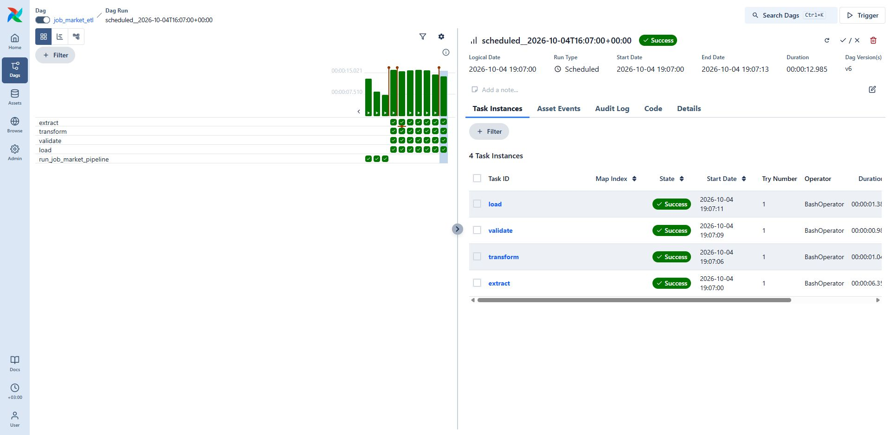
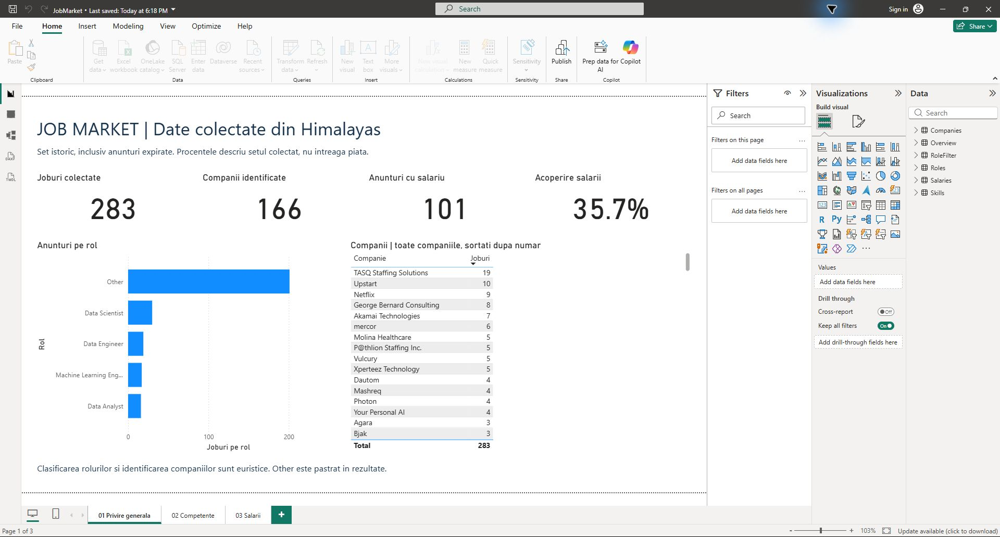
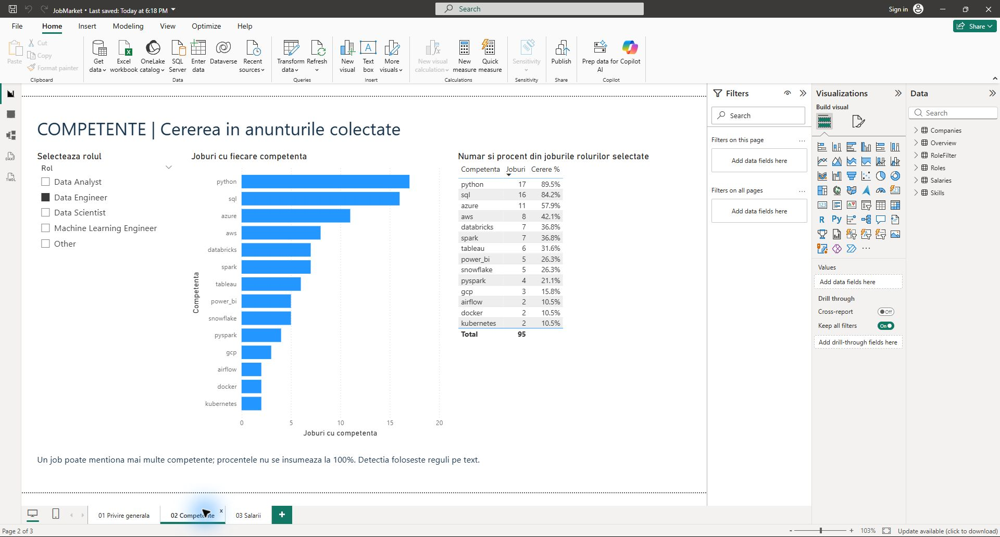
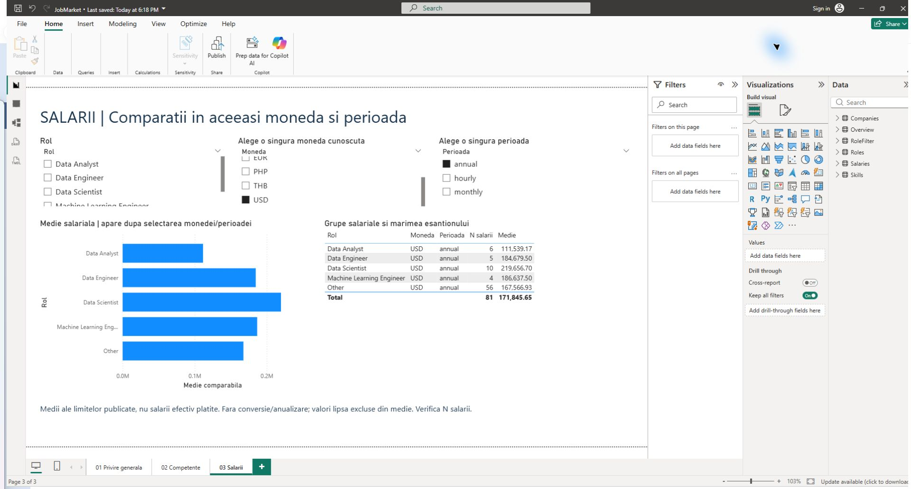
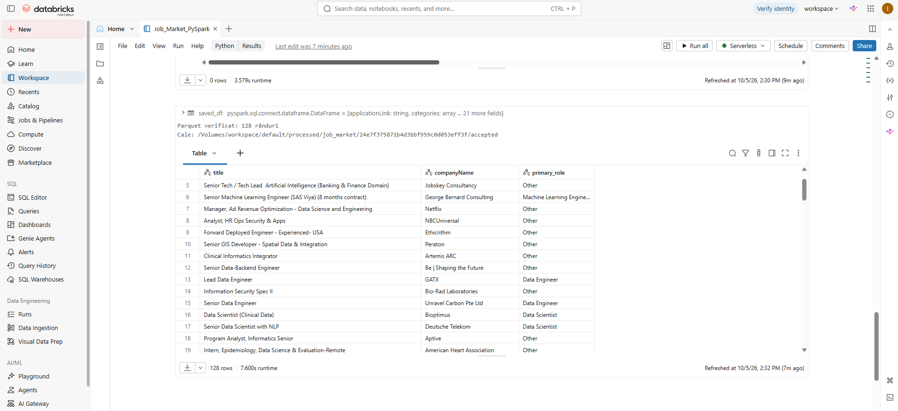
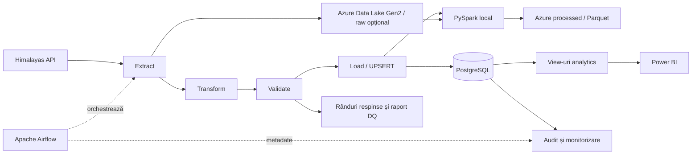
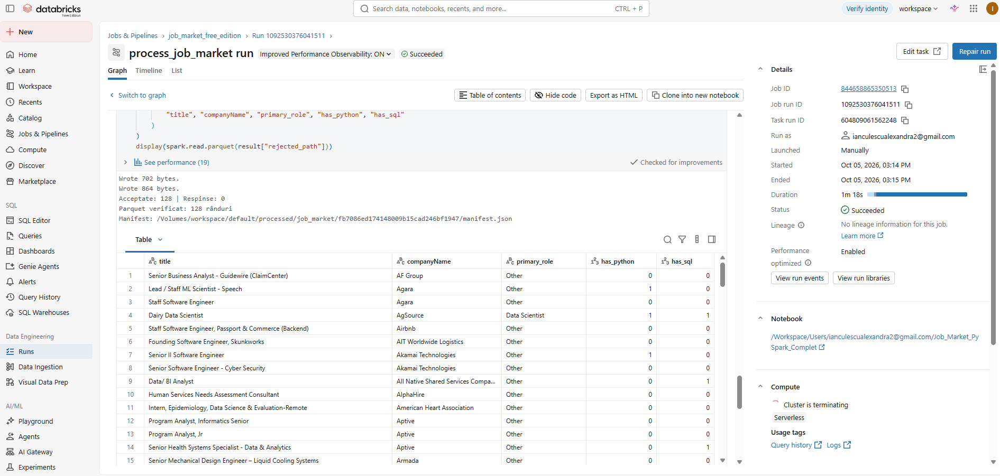

# Job Market Data Platform

Platformă de Data Engineering cu orchestrare locală și arhivare opțională în Azure Data Lake Gen2 care colectează anunțuri de angajare din Himalayas API, le curăță și validează, apoi le încarcă incremental în PostgreSQL. Apache Airflow orchestrează pipeline-ul, iar Power BI prezintă distribuția rolurilor, companiilor, competențelor și salariilor.

Proiectul demonstrează un flux complet: ingestie API, procesare cu Pandas, data quality, modelare relațională, încărcare idempotentă, audit persistent și monitorizare.

## Demonstrație

Capturi din aplicațiile reale: Airflow și Power BI la **4 octombrie 2026**, Databricks Free Edition la **5 octombrie 2026**. Raportul ilustrează snapshot-ul demonstrativ inclus în proiect; valorile sale nu reprezintă o măsurare a întregii piețe.

### Airflow: rulare programată reușită

Run-ul `scheduled__2026-10-04T16:07:00+00:00` a pornit automat la **19:07 Europe/Bucharest**. Toate cele patru task-uri au reușit din prima încercare, fără Trigger/Clear, în aproximativ 13 secunde. Auditul și logul load confirmă 134 rânduri acceptate, 0 respinse, 0 inserted, 1 updated și 133 skipped.



### Power BI: privire generală

Snapshot-ul conține 283 joburi și 166 companii; 101 anunțuri au salariu, cu o acoperire de 35,7%.



### Power BI: competențe pentru Data Engineer

Filtrul este pe Data Engineer. Python apare în 17 din 19 joburi (89,5%), iar SQL în 16 (84,2%). Un job poate menționa mai multe competențe.



### Power BI: salarii anuale în USD

Selecția folosește o singură monedă și o singură perioadă. Tabelul afișează și mărimea eșantionului; grupa Data Engineer are cinci salarii. Sunt limite salariale publicate în anunțuri, nu salarii efectiv plătite.



### Databricks Free Edition: PySpark și Parquet în cloud

Notebookul demonstrativ [Job_Market_PySpark_Demo.py](databricks/Job_Market_PySpark_Demo.py) a rulat pe compute Serverless, cu un snapshot JSON încărcat manual în `/Volumes/workspace/default/raw/raw.json`. A separat anunțurile în rânduri, a curățat câmpurile, a convertit salariile/datele, a clasificat rolurile și a aplicat validarea demonstrativă: **128 acceptate, 0 respinse**. Parquetul salvat în volumul managed `processed` a fost recitit, confirmând **128 de rânduri**.



Demonstrația folosește stocarea Databricks Free Edition, separat de containerele Azure ADLS. Pipeline-ul zilnic Airflow continuă să execute Spark local. Notebookul Demo păstrează varianta executată: verificarea Parquet compară numărul de rânduri; nu publică manifest, nu salvează rândurile respinse și nu detectează separat valorile neconvertibile devenite null. Nu reprezintă încă migrarea completă a validării proiectului. Varianta completată `Job_Market_PySpark_FreeEdition.py` include competențe, flaguri de conversie, respingeri Parquet, raport de calitate și manifest publicat după verificarea conținutului. Această versiune a fost verificată și în Free Edition: 128 acceptate, 0 respinse, Parquet verificat și manifest publicat.

## Arhitectură



## Tehnologii

- **Python și Pandas** — extragere, transformare și validare.
- **PostgreSQL 18 și SQLAlchemy** — stocare relațională și tranzacții.
- **Apache Airflow 3.3.2 / LocalExecutor** — orchestrare, retry și loguri.
- **Docker Compose** — mediu local reproductibil.
- **Azure Data Lake Gen2 și Microsoft Entra ID** — arhivare raw cu autentificare prin service principal.
- **Power BI** — model semantic și raport de analiză.
- **Pytest și GitHub Actions** — teste și workflow CI.

## Funcționalități

- Colectarea anunțurilor pentru Data Engineer, Data Scientist, Data Analyst și Machine Learning Engineer.
- Deduplicare după GUID, clasificarea rolurilor și identificarea a 17 competențe din titlu și descriere.
- Separarea rândurilor acceptate de cele respinse, cu motive și raport de calitate per run.
- UPSERT incremental: inserare, actualizare sau omiterea înregistrărilor identice.
- Sincronizarea companiilor și competențelor în aceeași tranzacție cu joburile.
- Audit persistent pentru rulări și încercări; reconciliere după întreruperi.
- Alerte locale pentru eșec terminal, respingeri peste prag și lipsa succesului zilnic.

## Pipeline și orchestrare

DAG-ul `job_market_etl` rulează zilnic, la **19:07** în `Europe/Bucharest` (`7 19 * * *`):

| Etapă | Responsabilitate |
| --- | --- |
| `extract` | Colectează și deduplică anunțurile; salvează rezultatul brut local și, opțional, în Azure. |
| `transform` | Normalizează câmpurile și derivă rolurile și competențele. |
| `validate` | Separă datele acceptate de cele respinse; blochează batchurile fără rânduri acceptate. |
| `load` | Încarcă datele acceptate prin UPSERT și actualizează relațiile. |
| `spark_process` | Procesează același snapshot raw cu PySpark și publică Parquet și manifest în Azure. |

Task-urile folosesc `BashOperator`, retry cu backoff și timeout. Artefactele intermediare sunt separate pe run. `max_active_runs=1` previne suprapunerea rulărilor ETL.

DAG-urile `job_market_audit_reconcile` și `job_market_monitor` rulează la fiecare cinci minute. Monitorul înregistrează alertele în PostgreSQL și tranzițiile în logurile Airflow, fără notificări externe. Pragul implicit pentru respingeri este **10%**, configurabil; lipsa succesului zilnic este semnalată după ora **20:07**.

## Modelul de date

| Tabel | Conținut |
| --- | --- |
| `jobs` | Anunțurile, salariile, rolurile și atributele derivate. |
| `companies` | Companiile normalizate. |
| `skills` | Catalogul competențelor. |
| `job_skills` | Relația many-to-many dintre joburi și competențe. |
| `job_runs` | Starea și contorii fiecărei rulări. |
| `job_run_attempts` | Istoricul încercărilor pentru fiecare etapă. |
| `pipeline_alerts` | Alerte persistente, cu stări `open` și `resolved`. |
| `pipeline_daily_checks` | Rezultatul verificării zilnice. |

View-urile din schema `analytics` oferă agregări pentru overview, roluri, companii, competențe și salarii. Analiza salarială păstrează separat monedele și perioadele de plată.

## Pornire locală

Ai nevoie de Docker cu Docker Compose și acces la Internet. Pentru raport este necesar Power BI Desktop. Execută comenzile din rădăcina proiectului.

### 1. Configurare

Copiază [.env.example](.env.example) într-un fișier local `.env` și înlocuiește toate valorile demonstrative:

```dotenv
DB_PASSWORD=<parola-locala>
AIRFLOW_JWT_SECRET=<secret-aleator-lung>
AIRFLOW_API_SECRET_KEY=<alt-secret-aleator-lung>
MAX_REJECTED_PERCENT=10
```

Fișierul `.env` este exclus din Git. Nu publica parole sau chei.

### 2. Pornire Airflow

```bash
docker compose build airflow-init airflow-api-server airflow-scheduler airflow-dag-processor
docker compose up -d airflow-api-server airflow-scheduler airflow-dag-processor
docker compose ps -a
```

Bazele de date pornesc prin dependențele Compose. `airflow-init` aplică migrarea metadatelor și se încheie normal cu codul 0.

Compose este destinat dezvoltării locale și include credențiale demonstrative pentru baza de metadate; acestea nu sunt o configurație pentru producție.

Deschide [Airflow UI](http://localhost:8080), autentifică-te cu configurația locală și activează `job_market_etl`, `job_market_audit_reconcile` și `job_market_monitor`. Pentru prima verificare, declanșează `job_market_etl` și urmărește cele cinci task-uri și logurile lui `load` și `spark_process`.

PostgreSQL pentru datele de business este accesibil de pe host la `localhost:5433`, baza `job_market_db`.

### 3. Execuție manuală

```bash
docker compose up -d db
docker compose run --rm --build etl
```

Execuția manuală folosește aceleași etape și reguli de calitate. Nu înlocuiește verificarea unei rulări orchestrate în Airflow.

### Baze existente

`sql/init.sql` și view-urile analytics sunt aplicate automat numai la inițializarea unui volum nou. Pentru o bază existentă, aplică migrările din `sql/migrations/` în ordine, apoi `sql/analytics_views.sql`, dacă nu sunt deja instalate. De exemplu:

```bash
docker compose cp sql/migrations/003_monitoring.sql db:/tmp/003_monitoring.sql
docker compose exec -T db psql -U postgres -d job_market_db -v ON_ERROR_STOP=1 -1 -f /tmp/003_monitoring.sql
```

Volumele păstrează datele între restarturi. `docker compose down -v` le șterge.

## Arhivare raw în Azure (opțional)

Creează un Storage Account cu hierarchical namespace activat și un container privat `raw`. Atribuie aplicației Microsoft Entra folosite de pipeline rolul **Storage Blob Data Contributor**, limitat la acest container. În `.env`, completează:

```dotenv
AZURE_UPLOAD_ENABLED=true
AZURE_STORAGE_ACCOUNT_NAME=<numele-contului>
AZURE_STORAGE_CONTAINER=raw
AZURE_TENANT_ID=<Directory-tenant-ID>
AZURE_CLIENT_ID=<Application-client-ID>
AZURE_CLIENT_SECRET=<valoarea-secretului>
```

Folosește valoarea secretului, nu Secret ID. Păstrează secretul local și înlocuiește-l înainte de expirare. Exemplul de mediu dezactivează integrarea implicit; execuția exclusiv locală rămâne disponibilă.

După modificarea dependențelor sau a configurației:

```bash
docker compose build airflow-scheduler etl
docker compose up -d airflow-api-server airflow-scheduler airflow-dag-processor
```

`extract` încarcă rezultatul colectat și deduplicat la `raw/jobs/<sha256(run_id)>/raw.json`. Reluarea aceluiași run folosește aceeași cale și poate înlocui conținutul cu rezultatul noii extrageri. Un run nou are altă cale. Manifestul local `data/runs/<sha256(run_id)>/azure_upload.json` păstrează calea, numărul de bytes și SHA256, fără credențiale. Transformarea și încărcarea PostgreSQL folosesc în continuare artefactele locale.

Când integrarea este activă, lipsa configurației sau eșecul uploadului oprește etapa `extract` și permite retry-ul Airflow. Uploadul nu creează containerul. Serviciile Azure pot consuma credit sau genera costuri în funcție de abonament și utilizare.

Verificat la **5 octombrie 2026**: run-ul manual Airflow `azure_integration_20261005_final` a reușit cu toate cele patru task-uri din prima încercare: 128 acceptate, 0 respinse, 0 inserted, 3 updated, 125 skipped. Fișierul Azure de 867609 bytes a fost descărcat și comparat cu artefactul local, inclusiv SHA256. Rularea automată `scheduled__2026-10-05T10:26:00+00:00`, la 13:26 Europe/Bucharest, a confirmat ulterior aceleași rezultate: toate task-urile din prima încercare, fără Trigger/Clear, iar fișierul descărcat din Azure a fost identic cu cel local. Ora a fost mutată temporar pentru demonstrație, apoi restabilită la 19:07.

## Procesare locală PySpark → Azure Parquet

Serviciul Docker opțional `spark` folosește PySpark 4.0.1 și Java 17 pentru execuție independentă. Aceleași dependențe sunt instalate și în imaginea Airflow pentru orchestrare. Citește un snapshot raw din Azure prin SDK, apoi procesează local datele cu Spark `local[2]`. Nu este un cluster distribuit și nu folosește încă Databricks sau acces Hadoop ABFS direct.

Creează containerul privat `processed` și atribuie aplicației rolul **Storage Blob Data Contributor** pe acesta. `AZURE_PROCESSED_CONTAINER` are valoarea implicită `processed`. Folosește identificatorul unei rulări existente cu upload raw:

```bash
docker compose --profile spark build spark
docker compose --profile spark run --rm spark --run-id 'scheduled__2026-10-05T10:26:00+00:00'
```

Spark deduplică după GUID păstrând primul rând, curăță titlul/compania, convertește salariile și datele UTC, clasifică rolurile și detectează competențele. Separă rândurile acceptate și respinse, cu motive de respingere. Publicarea este blocată dacă nu există rânduri acceptate.

Artefactele locale se află în `data/spark/<sha256(run_id)>/`: `raw.json`, directoarele Parquet `accepted` și `rejected`, plus `quality_report.json`. În Azure, fiecare procesare publică o versiune la `processed/jobs/<run-hash>/<raw-sha256>/<processing-id>/`. Fișierele sunt descărcate și comparate după upload; `manifest.json`, publicat ultimul, enumeră fișierele, bytes, SHA256 și contorii. Consumatorii trebuie să folosească doar versiunile cu manifest. Nu există încă retenție automată; o publicare întreruptă poate lăsa fișiere fără manifest.

Pentru verificare fără publicare, adaugă `--local-only`; pentru lucru offline, folosește `--local-raw data/runs/<run-hash>/raw.json`. SDK-ul transferă datele prin driver și stocarea locală; această variantă este potrivită snapshoturilor demonstrative, nu fișierelor care depășesc memoria/discul local.

```bash
docker compose --profile spark run --rm --entrypoint python spark -m pytest tests/test_spark_process.py -q
```

Verificat la 5 octombrie 2026: **2 teste Spark trecute**, inclusiv comparația tuturor coloanelor acceptate cu Pandas pe snapshotul local demonstrativ; testul de comparație este omis dacă acel snapshot lipsește. Fluxul Azure raw → Spark → processed a publicat **128 acceptate, 0 respinse**, cu verificare byte cu byte a fișierelor Parquet. Spark poate fi rulat independent sau ca ultimul task al pipeline-ului zilnic Airflow.

### Orchestrare Spark în Airflow

Fluxul curent este `extract → transform → validate → load → spark_process`, zilnic la 19:07 Europe/Bucharest. Task-ul Spark folosește BashOperator în schedulerul LocalExecutor, același run ID și retry/timeout ca etapele existente. Nu are nevoie de Docker socket sau de pornirea serviciului separat `spark`.

Când `AZURE_UPLOAD_ENABLED=true`, Spark descarcă raw din Azure și publică în containerul privat configurat prin `AZURE_PROCESSED_CONTAINER` (implicit `processed`). Când este `false`, `--airflow` selectează raw local al rulării și produce doar Parquet local. Eșecul Spark face întregul DAG failed; baza PostgreSQL poate fi deja actualizată, deoarece load precedă Spark. Auditul `job_runs` descrie cele patru etape PostgreSQL; starea completă, inclusiv Spark, se verifică în Airflow. Monitorul folosește starea DAG-ului și toate task-urile existente în metadate, păstrând compatibilitatea cu rulările istorice de patru task-uri.

După aceste schimbări de imagine și mediu:

```bash
docker compose build airflow-init airflow-api-server airflow-scheduler airflow-dag-processor
docker compose up -d airflow-api-server airflow-scheduler airflow-dag-processor
```

Pentru un eșec exclusiv Spark, reia doar `spark_process` prin Clear: nu este nevoie să refaci UPSERT-ul. Reprocesarea publică o versiune nouă cu manifest separat. Dacă reiei extract/transform/validate/load, reia și task-urile dependente, inclusiv Spark, ca rezultatele să reflecte noul snapshot. Fișierul local `quality_report.json` al procesării include calea manifestului Azure după succes. Secretul nu este trecut în comanda task-ului.

Verificat: rularea manuală orchestrată `spark_orchestration_final_20261005` are toate cele cinci task-uri `success`, fiecare din prima încercare. Spark a procesat 128 de rânduri acceptate, 0 respinse. Manifestul și cele trei fișiere Parquet au fost descărcate din Azure și verificate față de artefactele locale. Toate cele 59 de teste au trecut în mediul Airflow cu PostgreSQL temporar; modul local fără upload a fost verificat separat. Programarea rămâne la 19:07. Rularea programată de cinci task-uri rămâne de confirmat; demonstrația automată anterioară a inclus cele patru task-uri existente atunci.

Containerele Spark și Airflow folosesc același UID 50000 și grup 0 pentru artefactele partajate. Dacă există fișiere create anterior de un container Spark root, proprietarul lor trebuie corectat înainte de execuția Airflow.

## Databricks: demonstrație și migrare

Demonstrația pe Databricks Free Edition este verificată prin notebookul exportat și captura de mai sus. Nu s-a trecut la Pay-As-You-Go. Separat, notebookul parametrizat `databricks/job_market_notebook.py` și modulul `src/cloud_process.py` sunt pregătite pentru integrare prin Unity Catalog; testele lor locale au trecut, dar acea variantă nu a fost executată în workspace. Conectarea directă la Azure ADLS și înlocuirea taskului local Airflow nu sunt efectuate. Instrucțiuni: [Databricks](databricks/README.md).

## Raport Power BI

Raportul are trei pagini: **privire generală**, **competențe** și **salarii**. Proiectul editabil este `powerbi/JobMarket.pbip`, împreună cu folderele raportului și modelului semantic. Fișierul binar PBIX este exclus din Git.

Implicit, modelul folosește un snapshot pentru explorarea fără autentificare. Pentru importul datelor actualizate din PostgreSQL, setează parametrul `UsePostgreSQL=true` și configurează conexiunea locală. Refresh-ul snapshot-ului reîncarcă aceleași date.

Instrucțiuni: [documentația Power BI](powerbi/README.md).

## Structura proiectului

```text
├── dags/                 # Orchestrare ETL, reconciliere și monitorizare
├── src/                  # Etape Python, audit, model relațional și alerte
├── sql/                  # Schema, migrări și view-uri analytics
├── tests/                # Teste unitare, integrare și verificări SQL
├── powerbi/              # Raport și model semantic editabile
├── docs/                 # Contractele etapelor și procedura de reluare
├── data/                 # Artefacte locale generate, excluse din Git
├── logs/                 # Loguri locale generate, excluse din Git
├── compose.yaml
├── Dockerfile
├── Dockerfile.airflow
└── requirements.txt
```

## Teste și validare

```bash
python -m pip install -r requirements.txt
python -m pytest -v
```

Testele de integrare necesită `TEST_DATABASE_URL` către un PostgreSQL dedicat, cu numele bazei terminat în `_test`. Fără această variabilă, testele de integrare sunt omise. Nu folosi baza de business pentru teste.

Ultima verificare locală din **5 octombrie 2026**: **63 de teste trecute**, inclusiv UPSERT, rollback, data quality, audit, modelare, reconciliere, alerte, integrarea Azure simulată și procesarea Spark, pe PostgreSQL temporar. Pentru teste, setează `AZURE_UPLOAD_ENABLED=false` ca să eviți uploaduri reale; testele Azure controlează separat configurația. DAG-ul ETL a fost verificat cu toate task-urile reușite; monitorul a avut și o rulare programată reușită. Workflow-ul [GitHub Actions](.github/workflows/tests.yml) este configurat, dar rezultatul unui run CI nu a fost verificat.

## Limite și dezvoltări viitoare

- Mediul este local: calculatorul, Docker și Airflow trebuie să rămână active pentru programare și monitorizare.
- Rularea programată din 4 octombrie 2026, ora 19:07, a reușit automat: toate cele patru task-uri din prima încercare, fără Trigger/Clear. Funcționarea peste o noapte nesupravegheată rămâne de verificat.
- Sursa conține numai anunțurile colectate prin căutările configurate; rezultatele nu reprezintă întreaga piață a muncii.
- Competențele sunt detectate prin reguli textuale, iar salariile lipsă nu sunt estimate.
- Rularea completă pe volume noi, conexiunea directă Power BI și refresh-ul său programat necesită verificări suplimentare.
- Extensii posibile: notificări externe și migrarea orchestrării și procesării către Azure; arhivarea raw este deja implementată.

Detalii despre artefacte și reluarea task-urilor: [etapele Airflow](docs/airflow-stages.md).

## Fișiere pentru repository

Codul sursă, DAG-urile, schema SQL, testele, configurațiile fără secrete, proiectul Power BI text, snapshot-ul demonstrativ și capturile sunt incluse în prezentare. `.env`, datele brute/intermediare, logurile, cache-urile și PBIX-ul local sunt excluse din Git. Pentru a deschide raportul dintr-un clone, folosește `powerbi/JobMarket.pbip`; păstrează folderele raportului și modelului lângă el.

Verificare Free Edition, 5 octombrie 2026: notebookul complet afișează 128 acceptate, 0 respinse, Parquet verificat și manifest la `/Volumes/workspace/default/processed/job_market/8ea0adbd6d0a4d43b81d5099c592cc26/manifest.json`. Aceasta confirmă execuția manuală a notebookului complet; încărcarea raw rămâne manuală, iar Job-ul Databricks a fost verificat ulterior prin Run now.

## Databricks Job verificat

La 5 octombrie 2026, Job-ul `job_market_free_edition`, task `process_job_market`, a executat notebookul complet pe Serverless cu starea **Succeeded**. Rularea a fost lansată manual prin Run now și a durat 1 minut și 18 secunde: 128 acceptate, 0 respinse, Parquet verificat și manifest nou publicat. Sursa rămâne snapshotul încărcat manual; nu există încă o programare cloud confirmată sau integrare de declanșare din Airflow.



Programarea Job-ului a fost configurată de utilizatoare zilnic la 19:15:47 Europe/Bucharest; prima execuție automată nu este încă verificată. Pentru actualizare, se înlocuiește manual raw.json în volumul Databricks raw cu snapshotul unei rulări locale reușite, apoi se rulează Job-ul. Orele celor două programe nu creează o dependență automată de transfer între Airflow și Free Edition.

Configurație reproductibilă Job: [instrucțiuni și setări](databricks/JOB_CONFIGURATION.md). Șablonul este salvat; exportul exact a fost furnizat de utilizatoare și păstrat local și nu s-a efectuat deploy.
