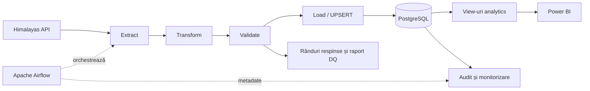

# Job Market Data Platform

Platformă locală de Data Engineering care colectează anunțuri de angajare din Himalayas API, le curăță și validează, apoi le încarcă incremental în PostgreSQL. Apache Airflow orchestrează pipeline-ul, iar Power BI prezintă distribuția rolurilor, companiilor, competențelor și salariilor.

Proiectul demonstrează un flux complet: ingestie API, procesare cu Pandas, data quality, modelare relațională, încărcare idempotentă, audit persistent și monitorizare.

## Demonstrație

Capturi din aplicațiile reale, realizate la **4 octombrie 2026**. Raportul ilustrează snapshot-ul demonstrativ inclus în proiect; valorile sale nu reprezintă o măsurare a întregii piețe.

### Airflow: rulare programată reușită

Run-ul `scheduled__2026-10-04T16:07:00+00:00` a pornit automat la **19:07 Europe/Bucharest**. Toate cele patru task-uri au reușit din prima încercare, fără Trigger/Clear, în aproximativ 13 secunde. Auditul și logul load confirmă 134 rânduri acceptate, 0 respinse, 0 inserted, 1 updated și 133 skipped.


### Power BI: privire generală

Snapshot-ul conține 283 joburi și 166 companii; 101 anunțuri au salariu, cu o acoperire de 35,7%.


### Power BI: competențe pentru Data Engineer

Filtrul este pe Data Engineer. Python apare în 17 din 19 joburi (89,5%), iar SQL în 16 (84,2%). Un job poate menționa mai multe competențe.


### Power BI: salarii anuale în USD

Selecția folosește o singură monedă și o singură perioadă. Tabelul afișează și mărimea eșantionului; grupa Data Engineer are cinci salarii. Sunt limite salariale publicate în anunțuri, nu salarii efectiv plătite.


## Arhitectură



## Tehnologii

- **Python și Pandas** — extragere, transformare și validare.
- **PostgreSQL 18 și SQLAlchemy** — stocare relațională și tranzacții.
- **Apache Airflow 3.3.2 / LocalExecutor** — orchestrare, retry și loguri.
- **Docker Compose** — mediu local reproductibil.
- **Power BI** — model semantic și raport de analiză.
- **Pytest și GitHub Actions** — teste și workflow CI.

## Funcționalități

- Colectarea anunțurilor pentru Data Engineer, Data Scientist, Data Analyst și Machine Learning Engineer.
- Deduplicare după GUID, clasificarea rolurilor și identificarea a 17 competențe din titlu și descriere.
- Separarea rândurilor acceptate de cele respinse, cu motive și raport de calitate per run.
- UPSERT incremental: inserare, actualizare sau omiterea înregistrărilor identice.
- Sincronizarea companiilor și competențelor în aceeași tranzacție cu joburile.
- Audit persistent pentru rulări și încercări; reconciliere după întreruperi.
- Alerte locale pentru eșec terminal, respingeri peste prag și lipsa succesului zilnic.

## Pipeline și orchestrare

DAG-ul `job_market_etl` rulează zilnic, la **19:07** în `Europe/Bucharest` (`7 19 * * *`):

| Etapă | Responsabilitate |
| --- | --- |
| `extract` | Colectează și deduplică anunțurile; salvează rezultatul brut. |
| `transform` | Normalizează câmpurile și derivă rolurile și competențele. |
| `validate` | Separă datele acceptate de cele respinse; blochează batchurile fără rânduri acceptate. |
| `load` | Încarcă datele acceptate prin UPSERT și actualizează relațiile. |

Task-urile folosesc `BashOperator`, retry cu backoff și timeout. Artefactele intermediare sunt separate pe run. `max_active_runs=1` previne suprapunerea rulărilor ETL.

DAG-urile `job_market_audit_reconcile` și `job_market_monitor` rulează la fiecare cinci minute. Monitorul înregistrează alertele în PostgreSQL și tranzițiile în logurile Airflow, fără notificări externe. Pragul implicit pentru respingeri este **10%**, configurabil; lipsa succesului zilnic este semnalată după ora **20:07**.

## Modelul de date

| Tabel | Conținut |
| --- | --- |
| `jobs` | Anunțurile, salariile, rolurile și atributele derivate. |
| `companies` | Companiile normalizate. |
| `skills` | Catalogul competențelor. |
| `job_skills` | Relația many-to-many dintre joburi și competențe. |
| `job_runs` | Starea și contorii fiecărei rulări. |
| `job_run_attempts` | Istoricul încercărilor pentru fiecare etapă. |
| `pipeline_alerts` | Alerte persistente, cu stări `open` și `resolved`. |
| `pipeline_daily_checks` | Rezultatul verificării zilnice. |

View-urile din schema `analytics` oferă agregări pentru overview, roluri, companii, competențe și salarii. Analiza salarială păstrează separat monedele și perioadele de plată.

## Pornire locală

Ai nevoie de Docker cu Docker Compose și acces la Internet. Pentru raport este necesar Power BI Desktop. Execută comenzile din rădăcina proiectului.

### 1. Configurare

Copiază [.env.example](.env.example) într-un fișier local `.env` și înlocuiește toate valorile demonstrative:

```dotenv
DB_PASSWORD=<parola-locala>
AIRFLOW_JWT_SECRET=<secret-aleator-lung>
AIRFLOW_API_SECRET_KEY=<alt-secret-aleator-lung>
MAX_REJECTED_PERCENT=10
```

Fișierul `.env` este exclus din Git. Nu publica parole sau chei.

### 2. Pornire Airflow

```bash
docker compose build airflow-init airflow-api-server airflow-scheduler airflow-dag-processor
docker compose up -d airflow-api-server airflow-scheduler airflow-dag-processor
docker compose ps -a
```

Bazele de date pornesc prin dependențele Compose. `airflow-init` aplică migrarea metadatelor și se încheie normal cu codul 0.

Compose este destinat dezvoltării locale și include credențiale demonstrative pentru baza de metadate; acestea nu sunt o configurație pentru producție.

Deschide [Airflow UI](http://localhost:8080), autentifică-te cu configurația locală și activează `job_market_etl`, `job_market_audit_reconcile` și `job_market_monitor`. Pentru prima verificare, declanșează `job_market_etl` și urmărește cele patru task-uri și logurile lui `load`.

PostgreSQL pentru datele de business este accesibil de pe host la `localhost:5433`, baza `job_market_db`.

### 3. Execuție manuală

```bash
docker compose up -d db
docker compose run --rm --build etl
```

Execuția manuală folosește aceleași etape și reguli de calitate. Nu înlocuiește verificarea unei rulări orchestrate în Airflow.

### Baze existente

`sql/init.sql` și view-urile analytics sunt aplicate automat numai la inițializarea unui volum nou. Pentru o bază existentă, aplică migrările din `sql/migrations/` în ordine, apoi `sql/analytics_views.sql`, dacă nu sunt deja instalate. De exemplu:

```bash
docker compose cp sql/migrations/003_monitoring.sql db:/tmp/003_monitoring.sql
docker compose exec -T db psql -U postgres -d job_market_db -v ON_ERROR_STOP=1 -1 -f /tmp/003_monitoring.sql
```

Volumele păstrează datele între restarturi. `docker compose down -v` le șterge.

## Raport Power BI

Raportul are trei pagini: **privire generală**, **competențe** și **salarii**. Proiectul editabil este `powerbi/JobMarket.pbip`, împreună cu folderele raportului și modelului semantic. Fișierul binar PBIX este exclus din Git.

Implicit, modelul folosește un snapshot pentru explorarea fără autentificare. Pentru importul datelor actualizate din PostgreSQL, setează parametrul `UsePostgreSQL=true` și configurează conexiunea locală. Refresh-ul snapshot-ului reîncarcă aceleași date.

Instrucțiuni: [documentația Power BI](powerbi/README.md).

## Structura proiectului

```text
├── dags/                 # Orchestrare ETL, reconciliere și monitorizare
├── src/                  # Etape Python, audit, model relațional și alerte
├── sql/                  # Schema, migrări și view-uri analytics
├── tests/                # Teste unitare, integrare și verificări SQL
├── powerbi/              # Raport și model semantic editabile
├── docs/                 # Contractele etapelor și procedura de reluare
├── data/                 # Artefacte locale generate, excluse din Git
├── logs/                 # Loguri locale generate, excluse din Git
├── compose.yaml
├── Dockerfile
├── Dockerfile.airflow
└── requirements.txt
```

## Teste și validare

```bash
python -m pip install -r requirements.txt
python -m pytest -v
```

Testele de integrare necesită `TEST_DATABASE_URL` către un PostgreSQL dedicat, cu numele bazei terminat în `_test`. Fără această variabilă, testele de integrare sunt omise. Nu folosi baza de business pentru teste.

Ultima verificare locală din **4 octombrie 2026**: **48 de teste trecute**, inclusiv UPSERT, rollback, data quality, audit, modelare, reconciliere și alerte, pe PostgreSQL temporar. DAG-ul ETL a fost verificat cu toate task-urile reușite; monitorul a avut și o rulare programată reușită. Workflow-ul [GitHub Actions](.github/workflows/tests.yml) este configurat, dar rezultatul unui run CI nu a fost verificat.

## Limite și dezvoltări viitoare

- Mediul este local: calculatorul, Docker și Airflow trebuie să rămână active pentru programare și monitorizare.
- Rularea programată din 4 octombrie 2026, ora 19:07, a reușit automat: toate cele patru task-uri din prima încercare, fără Trigger/Clear. Funcționarea peste o noapte nesupravegheată rămâne de verificat.
- Sursa conține numai anunțurile colectate prin căutările configurate; rezultatele nu reprezintă întreaga piață a muncii.
- Competențele sunt detectate prin reguli textuale, iar salariile lipsă nu sunt estimate.
- Rularea completă pe volume noi, conexiunea directă Power BI și refresh-ul său programat necesită verificări suplimentare.
- Extensii posibile: notificări externe și migrarea orchestrării/stocării către Azure.

Detalii despre artefacte și reluarea task-urilor: [etapele Airflow](docs/airflow-stages.md).

## Fișiere pentru repository

Codul sursă, DAG-urile, schema SQL, testele, configurațiile fără secrete, proiectul Power BI text, snapshot-ul demonstrativ și capturile sunt incluse în prezentare. `.env`, datele brute/intermediare, logurile, cache-urile și PBIX-ul local sunt excluse din Git. Pentru a deschide raportul dintr-un clone, folosește `powerbi/JobMarket.pbip`; păstrează folderele raportului și modelului lângă el.
